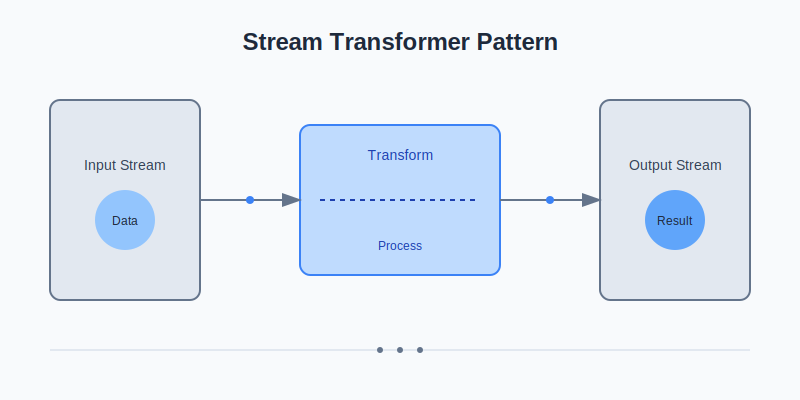
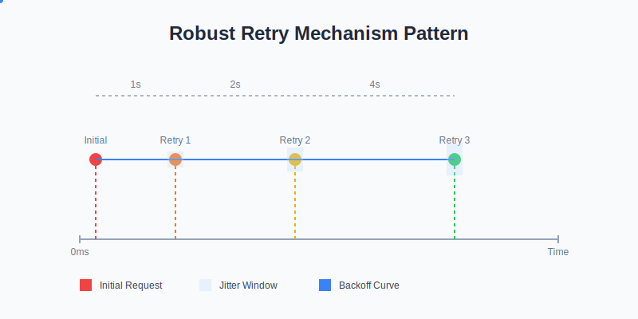
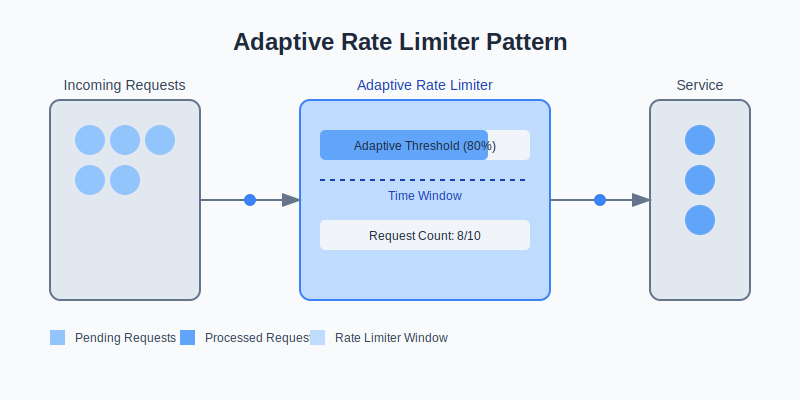

# Node.js Advanced Patterns

## Table of Contents

- Dependency Injection Container
    - Dynamic dependency management
    - Service registration and resolution
    - Supports complex dependency graphs


- Circuit Breaker Pattern
    - Prevents cascading failures
    - Automatic recovery mechanism
    - Configurable failure thresholds
    - Different circuit states (CLOSED, OPEN, HALF_OPEN)


- [Streaming Transformer](./examples/StreamTransformer.js)

    - Advanced stream processing
    - Composable transformation streams
    - Supports async transformations
    - Easy stream composition
  
  ```bash
    $ node run example:1
  ```


- [Robust Retry Mechanism](./examples/RetryMechanism.js)

    - Exponential backoff with jitter
    - Configurable retry strategies
    - Prevents thundering herd problem
    - Intelligent delay calculation

  ```bash
    $ node run example:2
  ```


- [Adaptive Rate Limiter](./examples/AdaptiveRateLimiter.js)

    - Dynamic request throttling
    - Adaptive threshold management
    - Prevents system overload
    - Flexible configuration

  ```bash
    $ node run example:3
  ```


- Dynamic Plugin System
    - Runtime plugin loading
    - Hot-reload capabilities
    - Safe plugin execution
    - Error-tolerant plugin management
