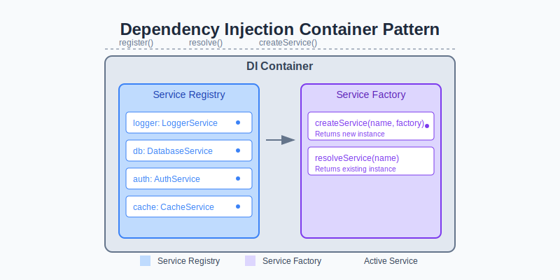

# Node.js Advanced Patterns

## Table of Contents

- **[Dependency Injection Container](./examples/DependencyInjectionContainer.js)**

    - Dynamic dependency management
    - Service registration and resolution
    - Supports complex dependency graphs
    - [Full Article (Medium)](https://v-checha.medium.com/node-js-advanced-patterns-dependency-injection-container-45938e88e873)

```bash
    npm run example:4
```

- Circuit Breaker Pattern
    - Prevents cascading failures
    - Automatic recovery mechanism
    - Configurable failure thresholds
    - Different circuit states (CLOSED, OPEN, HALF_OPEN)


- **[Streaming Transformer](./examples/StreamTransformer.js)**

    - Advanced stream processing
    - Composable transformation streams
    - Supports async transformations
    - Easy stream composition
    - [Full Article (Medium)](https://v-checha.medium.com/node-js-advanced-patterns-stream-transformer-1b1f3b1b3b3d)
  
```bash
  npm run example:1
```

- **[Robust Retry Mechanism](./examples/RetryMechanism.js)**

    - Exponential backoff with jitter
    - Configurable retry strategies
    - Prevents thundering herd problem
    - Intelligent delay calculation
    - [Full Article (Medium)](https://v-checha.medium.com/node-js-advanced-patterns-robust-retry-mechanism-1b1f3b1b3b3d)

```bash
  npm run example:2
```


- **[Adaptive Rate Limiter](./examples/AdaptiveRateLimiter.js)**

    - Dynamic request throttling
    - Adaptive threshold management
    - Prevents system overload
    - Flexible configuration
    - [Full Article (Medium)](https://medium.com/@v-checha/node-js-advanced-patterns-adaptive-rate-limiter-aa8221177162)

```bash
  npm run example:3
```

- Dynamic Plugin System
    - Runtime plugin loading
    - Hot-reload capabilities
    - Safe plugin execution
    - Error-tolerant plugin management
